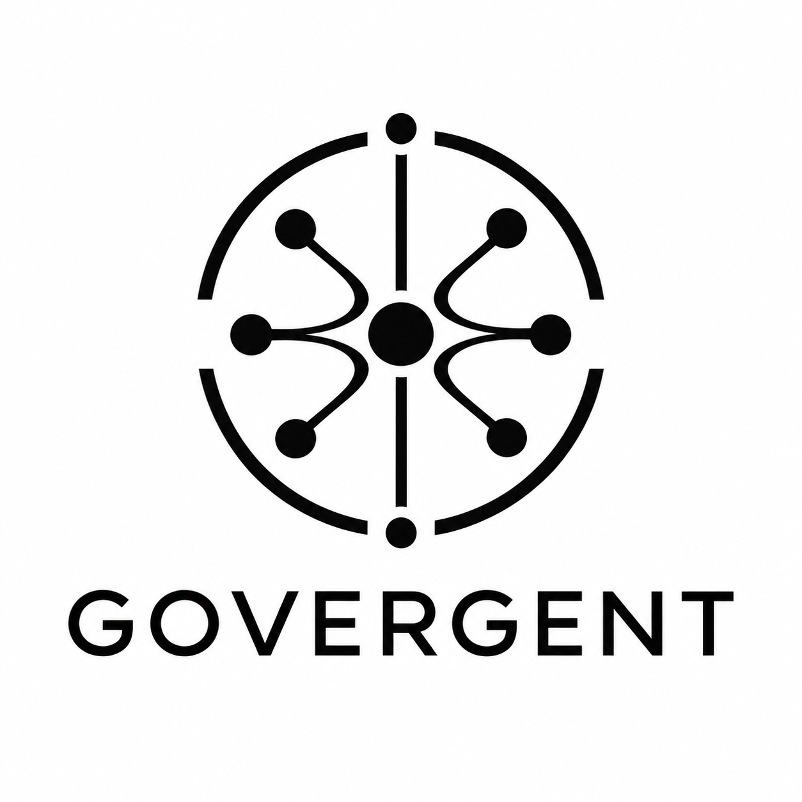

<div align="center">



<br>

### Governance and Service-Level Management for Agentic Systems

**A working group for defining how autonomous AI systems are governed, measured, and held to explicit service-level commitments.**

</div>

---

## Why GOVERGENT?

Agentic systems do more than generate outputs.

They **plan, delegate, call tools, interact with external systems, make decisions, recover from failures, and operate over extended periods of time**. As autonomy increases, traditional application-level monitoring and static governance controls are no longer enough.

We need a way to answer questions such as:

- What does *reliable behavior* mean for an AI agent?
- How should an agent's service level be defined and measured?
- Which actions require stronger guarantees than others?
- How do we express constraints, policies, escalation paths, and failure budgets?
- How should SLAs and SLOs apply to multi-agent systems?
- How can agent behavior be audited without eliminating useful autonomy?
- What happens when an agent violates a service-level commitment?

**GOVERGENT exists to develop practical answers to these questions.**

---

## Mission

GOVERGENT explores specifications, patterns, metrics, and reference architectures for:

> **Governance and Service-Level Management for Agentic Systems**

Our goal is to make agentic systems **observable, accountable, measurable, and governable** without reducing governance to a simple allow/deny layer.

We treat governance as an operational property of the system.

---

## Core idea

Traditional services are commonly governed through measurable commitments:

```text
Service
  └── SLO
       └── SLI
            └── Telemetry
```

Agentic systems introduce additional dimensions:

```text
Agentic System
  ├── Goals
  ├── Policies
  ├── Actions
  ├── Tools
  ├── Delegation
  ├── Decisions
  └── Outcomes
        │
        ▼
  Service-Level Commitments
        │
        ├── Reliability
        ├── Safety
        ├── Quality
        ├── Cost
        ├── Latency
        ├── Compliance
        └── Autonomy
```

GOVERGENT investigates how these dimensions can become **explicit, measurable contracts** rather than implicit expectations.

---

## Scope

The working group is interested in areas including:

### Agentic SLIs, SLOs and SLAs

Defining measurable indicators and objectives for autonomous systems, including dimensions beyond availability and latency.

Examples may include:

- task completion rate
- successful tool execution
- policy adherence
- decision quality
- escalation rate
- intervention rate
- recovery effectiveness
- cost per successful objective
- bounded autonomy
- execution latency
- reproducibility
- trace completeness

### Governance policies

Mechanisms for expressing and enforcing constraints on agent behavior:

- permissions
- action boundaries
- resource budgets
- tool access
- delegation policies
- human approval requirements
- escalation rules
- operational risk tiers

### Runtime governance

Governance that happens **while agents are operating**, not only during model development.

This includes:

- policy evaluation
- runtime controls
- dynamic authorization
- circuit breakers
- fallbacks
- graceful degradation
- intervention mechanisms
- automated remediation

### Observability and auditability

Making agent behavior inspectable and measurable through:

- traces
- decisions
- plans
- tool calls
- policy evaluations
- state transitions
- outcomes
- violations
- interventions

### Multi-agent systems

Service-level management becomes more complex when agents delegate work to other agents.

GOVERGENT explores questions such as:

- How are guarantees propagated across agents?
- Who owns the failure budget?
- How is responsibility attributed?
- How should delegation affect trust and authorization?
- Can service-level commitments compose across agent boundaries?

---

## Principles

GOVERGENT work is guided by a few simple principles.

**Measurable over subjective**  
Governance should rely on observable properties wherever possible.

**Runtime over static**  
Policies must remain meaningful during execution, not only at design time.

**Explicit over implicit**  
Expectations should become contracts, objectives, policies, or constraints.

**Outcome-aware**  
Successful execution is not only about whether a request completed, but whether the resulting behavior satisfied the intended objective.

**Composable**  
Governance mechanisms should work across tools, models, agents, and organizations.

**Vendor-neutral**  
The concepts should apply across agent frameworks, model providers, and infrastructure stacks.

---

## Workstreams

GOVERGENT aims to develop work around areas such as:

| Workstream | Focus |
|---|---|
| **Agentic SLOs** | Defining service-level objectives for autonomous systems |
| **Governance Model** | Common terminology and conceptual model |
| **Policy Contracts** | Machine-readable policies and constraints |
| **Runtime Controls** | Enforcement, escalation and remediation |
| **Agentic Observability** | Telemetry, traces and evidence |
| **Multi-Agent Governance** | Delegation, responsibility and composition |
| **Reference Architecture** | Practical implementation patterns |
| **Interoperability** | Portable governance contracts across platforms |

